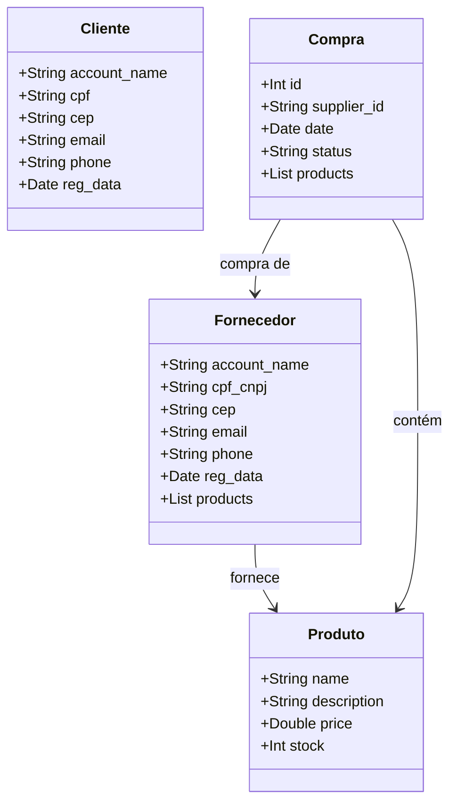

```mermaid
classDiagram
class Produto {
    +String name
    +String description
    +Double price
    +Int stock
}
class Cliente {
    +String account_name
    +String cpf
    +String cep
    +String email
    +String phone
    +Date reg_data
}
class Fornecedor {
    +String account_name
    +String cpf_cnpj
    +String cep
    +String email
    +String phone
    +Date reg_data
    +List<Produto> products
}
class Compra {
    +Int id
    +String supplier_id
    +Date date
    +String status
    +List<Produto> products
}
    Fornecedor --> Produto : fornece
    Compra --> Fornecedor : compra de
    Compra --> Produto : contém
```