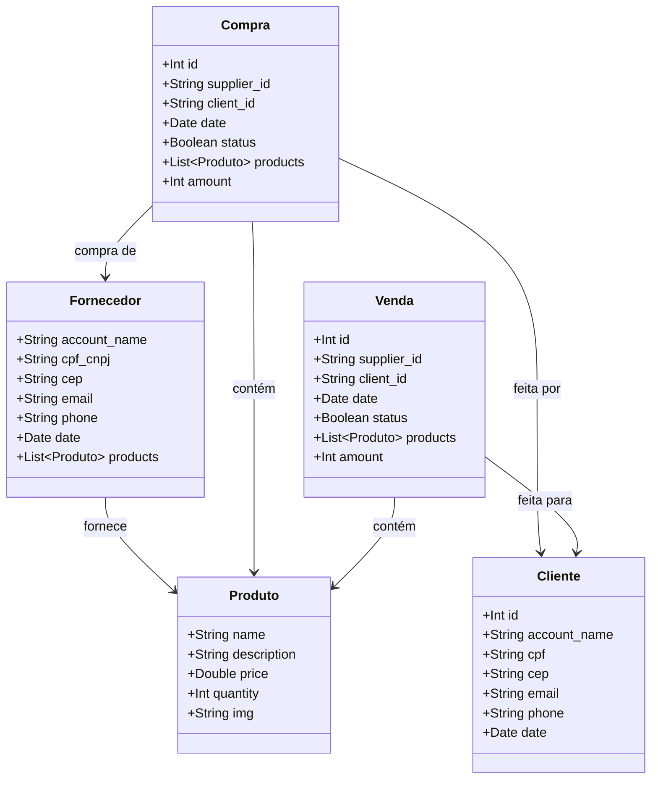

## Diagrama de Classes

```mermaid
classDiagram
    class Produto {
        +String name
        +String description
        +Double price
        +Int quantity
        +String img
    }
    class Cliente {
        +Int id
        +String account_name
        +String cpf
        +String cep
        +String email
        +String phone
        +Date date
    }
    class Fornecedor {
        +String account_name
        +String cpf_cnpj
        +String cep
        +String email
        +String phone
        +Date date
        +List~Produto~ products
    }
    class Compra {
        +Int id
        +String supplier_id
        +String client_id
        +Date date
        +Boolean status
        +List~Produto~ products
        +Int amount
    }
    class Venda {
        +Int id
        +String supplier_id
        +String client_id
        +Date date
        +Boolean status
        +List~Produto~ products
        +Int amount
    }
    Fornecedor --> Produto : fornece
    Compra --> Fornecedor : compra de
    Compra --> Cliente : feita por
    Compra --> Produto : contém
    Venda --> Cliente : feita para
    Venda --> Produto : contém
```

Projeto em desenvolvimento, tentando praticar conceitos de controller, service, model, domain e DTO.
